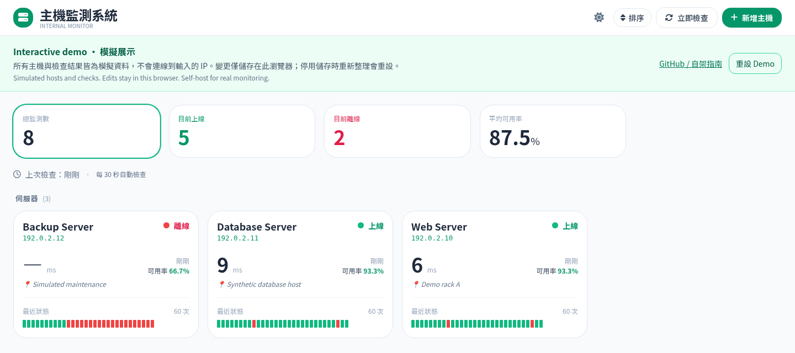

# Host Monitor 主機監測系統

[English](README.md) · [Demo](https://kageryo.github.io/host-monitor/)

輕量、適合自架的 IPv4 主機監測儀表板，可用於伺服器、NAS、印表機與其他設備。後端從部署主機執行 ICMP ping，網頁顯示在線狀態、回應時間、可用率與最近檢查紀錄。

[](LICENSE)
[](https://nodejs.org/)
[](https://expressjs.com/)
[](#資料與日誌)
[](https://github.com/KageRyo/host-monitor/stargazers)
[](https://github.com/KageRyo/host-monitor/commits)

[](https://kageryo.github.io/host-monitor/)

## 功能概覽

| 功能 | 行為 |
| --- | --- |
| 主機檢查 | 預設每 30 秒 ping，可手動檢查單台或全部主機 |
| 儀表板 | 分類狀態卡片、回應時間、可用率與心跳歷史 |
| 主機管理 | 新增、編輯、刪除 IPv4 目標，設定名稱、類別與備註 |
| 整理與篩選 | 自訂類別順序、只看上線或離線主機 |
| 外觀 | 明暗主題，目前介面為正體中文 |
| 儲存 | 本地 JSON，無需資料庫服務 |

可用率依累計檢查的成功比例計算；每台主機另外保留最近 60 筆歷史。ping 成功表示網路可達，不代表 HTTP 服務或應用程式正常。

## 快速開始

需要 Node.js 18 以上、npm 與可用的系統 `ping` 指令。Bash 啟停腳本另需 `setsid` 及 Linux 程序管理工具；其他平台可在具備相容 ping 工具時使用 `npm start` 前景執行。

```bash
git clone https://github.com/KageRyo/host-monitor.git
cd host-monitor
npm ci --omit=dev --ignore-scripts
npm start
```

開啟 `http://localhost:3000`。首次啟動的主機清單為空，點擊「新增主機」輸入 IPv4 位址、名稱、類別與備註。

Linux 背景執行：

```bash
./start.sh
./stop.sh
```

`start.sh` 顯示本機網址，PID 儲存於 `logs/server.pid`；區域網路網址記錄於 `logs/monitor.log`。

## 從檔案匯入目標

可直接在網頁管理主機，或在啟動前準備資料檔：

```bash
mkdir -p data
cp monitors.example.json data/monitors.json
```

將範例位址與名稱改成自己的設備。手動編輯資料檔前先停止服務，修改後重新啟動載入。網頁 API 目前只接受 IPv4，不支援網域名稱或 IPv6。

## 環境變數

複製 [.env.example](.env.example) 為 `.env` 即可自訂設定；程序環境變數優先於 `.env`。

| 變數 | 預設值 | 用途 |
| --- | --- | --- |
| `PORT` | `3000` | HTTP 監聽連接埠 |
| `CHECK_INTERVAL` | `30000` | 自動檢查間隔，單位為毫秒 |
| `LOG_MAX_BYTES` | `5242880` | 日誌輪替門檻，單位為 bytes（5 MiB） |
| `LOG_MAX_FILES` | `5` | 保留的備份數；設為 `0` 時輪替會丟棄舊日誌 |
| `LOG_TO_STDOUT` | 終端機中為 `true`，其餘為 `false` | 是否同時輸出到主控台 |

範例 `.env` 明確設定 `LOG_TO_STDOUT=false`。後端直接載入 `.env`，無需額外的 dotenv 套件。

## 資料與日誌

- `data/monitors.json`：目標、備註、類別順序、累計檢查次數與最近歷史。
- `logs/monitor.log`：應用程式日誌；預設備份為 `monitor.log.1` 至 `monitor.log.5`。
- `logs/startup.log`：透過 `start.sh` 啟動時的輸出。

`data/`、`logs/` 與本地環境檔已加入 `.gitignore`。需要保留設定與累計數據時，請備份 `data/monitors.json`。預設間隔下，60 筆歷史約涵蓋 30 分鐘。

```bash
tail -f logs/monitor.log
```

## 部署

部署主機必須能連到監測目標。HTTP 服務監聽 `0.0.0.0`，防火牆允許時可由主機各網路介面存取。目前沒有內建登入驗證，適合可信任網路；需要遠端存取時，請放在有身分驗證的反向代理後方。

長期執行可用 [PM2](https://pm2.keymetrics.io/) 直接管理 `server.js`：

```bash
npm install -g pm2
pm2 start server.js --name host-monitor
pm2 save
pm2 startup
```

依 `pm2 startup` 印出的指令完成系統啟動設定。

## 互動 Demo

靜態 demo 沿用現有儀表板，提供八台虛構主機、上線／離線狀態與每 30 秒一次的模擬檢查。可以新增、編輯、刪除主機、手動檢查、排序類別、篩選狀態與切換主題。**不會連線到輸入的位址**，頁面上方有明確的模擬資料提示。

變更以獨立的 localStorage key 保存在訪客瀏覽器，按「重設 Demo」可還原範例。停用瀏覽器儲存時仍可操作，但重新整理會重設。樣式、圖示與字型仍透過外部 CDN 載入。

不需安裝後端依賴即可建置與預覽：

```bash
npm run build:demo
python3 -m http.server 8080 --directory demo-dist
```

開啟 `http://localhost:8080`。自架服務也可透過 `http://localhost:3000/?demo=1` 使用模擬模式；一般網址使用真正的後端 API。

### 發布到 GitHub Pages

[Demo Pages workflow](.github/workflows/demo-pages.yml) 在 PR 中執行測試與建置；推送到 `main` 或在 `main` 手動執行時，只發布產生的前端檔案。

1. 到專案 **Settings → Pages**，將 Source 設為 **GitHub Actions**。
2. 將 demo 變更合併到 `main`；若已合併，可在 **Actions → Demo Pages → Run workflow** 選擇 `main` 手動執行。
3. 部署成功後開啟 [demo](https://kageryo.github.io/host-monitor/)。

網址會在啟用 Pages 且首次部署成功後可用。設定細節見 [GitHub 官方文件](https://docs.github.com/en/pages/getting-started-with-github-pages/using-custom-workflows-with-github-pages)。真正的 ICMP 檢查與 Node.js API 仍需自架後端。

## 開發

後端使用 Express 5 與 `ping` 套件；前端為 Vanilla JavaScript、Tailwind CSS 與 Font Awesome。樣式、圖示與字型目前透過外部 CDN 載入。

```bash
npm install
npm test
node --check server.js
npm start
```

`npm test` 使用 Node.js 內建測試工具驗證 demo 資料操作；CI 也會執行儀表板的瀏覽器測試。

## License

[MIT](LICENSE) © 2026 Chien-Hsun Chang.
